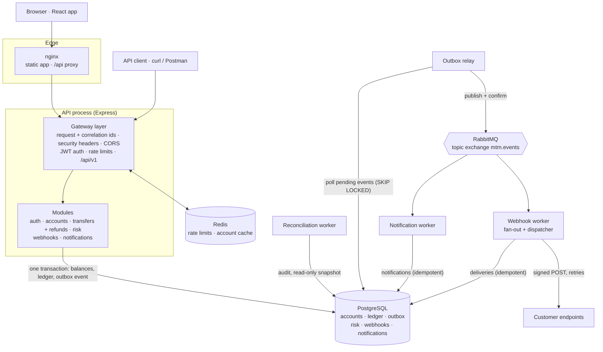

# Architecture

Move the Money is a payments platform: users open accounts, move money between them, and get notified and called back (webhooks) when money moves. The design rests on one rule:

> **PostgreSQL is the only source of truth for money.** Every debit and credit is a synchronous PostgreSQL transaction. Redis never decides a balance, and RabbitMQ never moves money; they only carry what happens *around* a committed transaction.

## Components

| Component | Responsibility | Code |
|---|---|---|
| nginx | Serves the built React app; proxies `/api` so the browser sees one origin | `frontend/nginx.conf` |
| Gateway layer | Request and correlation ids, security headers, CORS, JSON-only bodies, JWT auth, per-user and per-IP rate limits, `/api/v1` versioning | `src/app.ts`, `src/gateway/`, `src/middleware/` |
| Auth | Register and login (scrypt), HS256 access tokens, `requireAuth` | `src/auth/`, `src/routes/auth.ts` |
| Accounts | Open accounts (as a deposit from the funding account), list and read your own, cached reads | `src/services/accounts.ts`, `src/cache/` |
| Transfers | The money path: idempotency, row locks, risk, fees, ledger, outbox; refunds as compensating transfers | `src/services/transfers.ts`, `src/ledger.ts` |
| Risk | Rules over facts gathered inside the transfer's transaction | `src/risk.ts` |
| Outbox relay | Publishes committed events to RabbitMQ, at least once | `src/outbox-relay.ts`, `src/workers/outbox-relay.ts` |
| Consumers | Idempotent handlers with delayed retries and dead-letter queues | `src/messaging/` |
| Notifications | Events → per-user messages | `src/notifications/`, `src/workers/notifications.ts` |
| Webhooks | Events → deliveries → signed HTTP POSTs with backoff | `src/webhooks/`, `src/workers/webhooks.ts` |
| Reconciliation | Audits the ledger against balances | `src/reconciliation.ts`, `src/workers/reconciliation.ts` |
| Observability | JSON logs with service and correlation id; Prometheus metrics on the API and every worker | `src/logger.ts`, `src/metrics.ts` |

## Two paths through the system

**The money path is synchronous and transactional.** `POST /api/v1/transfers` runs, in one PostgreSQL transaction:

1. take an advisory lock on (user, idempotency key), and return the original if this is a retry;
2. lock both accounts with `SELECT … ORDER BY id FOR UPDATE`;
3. check ownership and the destination;
4. assess risk;
5. compute the fee in SQL and debit with a guard (`AND balance >= amount + fee`);
6. credit the receiver, and the fees account;
7. insert the transfer, its balanced ledger entries, the risk decision and the `transfer.completed` outbox event;
8. commit, then invalidate the two accounts' cache entries.

The client's `201` means the money moved and the event is durably recorded.

**The event path is asynchronous and at-least-once.** The relay publishes the outbox row to RabbitMQ and marks it published only after the broker confirms it. Each consumer has its own queue; it records the event id in `processed_events` in the same transaction as its own writes, so redelivery is harmless. Failures go through delay queues (1 s, 5 s, 25 s) and then to a dead-letter queue. Webhook HTTP calls happen in a separate dispatcher loop, with their own exponential backoff, so a slow customer endpoint never blocks a queue.

A correlation id follows a payment through both paths: from the `X-Correlation-Id` header (or the request id), into the outbox event, and into every consumer's log lines.

## Key decisions

| Decision | Why | Trade-off |
|---|---|---|
| **PostgreSQL as the financial source of truth** | Transactions, row locks, constraints and triggers enforce the money rules even if application code is wrong | Write throughput is bounded by one primary |
| **Raw SQL with `pg`, no ORM** | Correctness depends on exact statements and lock order, which should be visible in one file | More SQL to maintain by hand |
| **`NUMERIC` money as strings end to end** | Exact; stored, transmitted and displayed as the same value; JSON numbers can't round it | Clients must send strings |
| **Double-entry ledger alongside `accounts.balance`** | The balance is the lockable, fast running total; the ledger is the immutable audit trail it's checked against | Two writes per side of every movement |
| **Transactional outbox** | An event exists if and only if its money movement committed; broker outages can't lose events | Events arrive a moment after the response (relay polling) |
| **RabbitMQ for side effects only** | Notifications and webhooks shouldn't slow or break transfers | At-least-once delivery, so every consumer must be idempotent |
| **Synchronous risk checks** | The decision gates the money, so it must be made before commit, under the account lock | Adds a query to every transfer |
| **Redis fail-open** | Rate limits and cache protect and speed up the API; a Redis outage shouldn't become an API outage | During an outage, no rate limiting |
| **Modular monolith plus workers** (not one service per box) | One API process keeps transactions local; workers are separate processes because they scale and fail independently | Modules share a database; extracting a service later needs an API between them |
| **Gateway as a layer, not a service** | One process applies ids, CORS, auth and limits in order, with no extra hop | Edge concerns live in the app rather than in a proxy such as Envoy |
| **Polling for the relay and for notifications in the UI** | Simple, survives reconnects, easy to reason about | Up to ~0.5 s event latency; 5 s UI latency |

Each decision is explained in more depth, with what was tested, in [milestones/](milestones/). The money guarantees are in [financial-integrity.md](financial-integrity.md), failure behaviour in [failure-modes.md](failure-modes.md), and growth limits in [scaling.md](scaling.md).

## Data model

| Table | Holds |
|---|---|
| `users` | Email (unique, case-insensitive) and scrypt password hash |
| `accounts` | Owner, names, `balance NUMERIC(38,2)`, `kind` (`customer` or `system`). `CHECK (kind = 'system' OR balance >= 0)` |
| `transfers` | Every movement: `kind` (`transfer`, `deposit`, `refund`, `adjustment`), amount, fee, `refund_of`, idempotency key (unique per user), risk decision |
| `ledger_entries` | Debit and credit lines per transfer; immutable (trigger) and balanced at commit (deferred constraint trigger) |
| `outbox_events` | Domain events awaiting publication |
| `processed_events` | (consumer, event id) pairs, for idempotent consumers |
| `risk_decisions` | Every approve / review / reject, with reasons |
| `webhook_endpoints`, `webhook_deliveries` | Customer endpoints, and each delivery with attempts, status and next attempt |
| `notifications` | Per-user messages, unique per (user, event) |
| `reconciliation_runs` | Each audit's status and issues |

Schema changes are numbered SQL migrations (`migrations/001…011`), applied once and in order under an advisory lock.

## Deployment

`docker compose up -d --build` runs everything: PostgreSQL, Redis, RabbitMQ, a one-shot migration job, the API, four workers and nginx. Every service has a health check, startup waits for migrations, and workers restart after losing the broker. CI runs lint, typecheck, the backend suite against real PostgreSQL, RabbitMQ and Redis, the frontend build and tests, and a browser end-to-end test against the composed stack.
